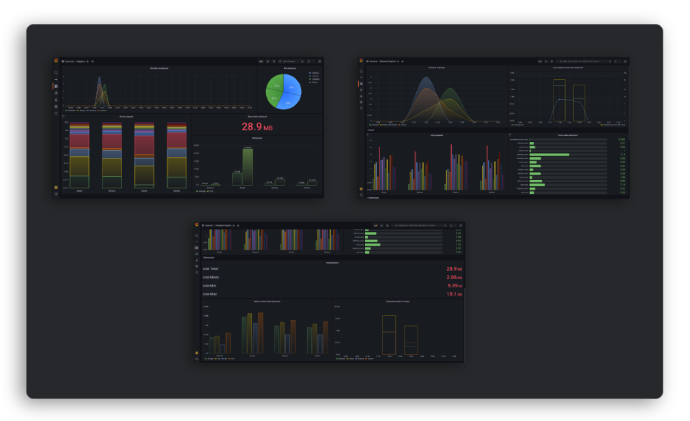
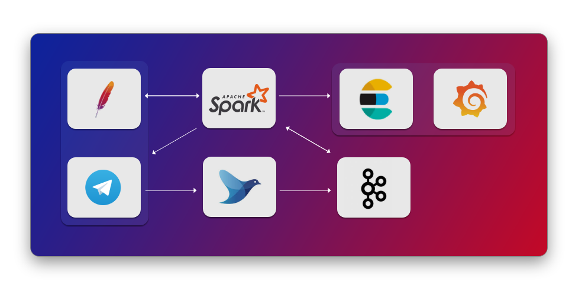
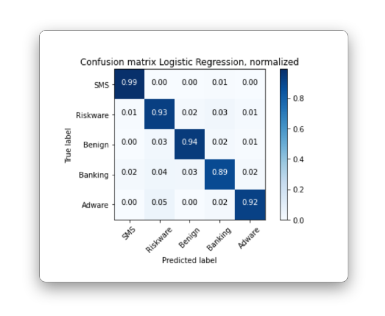
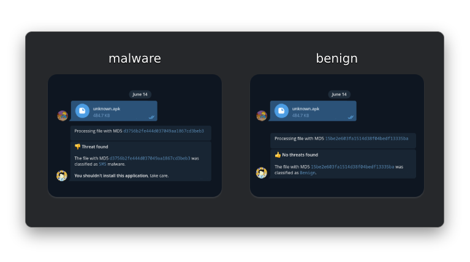

# Kapline: malware detection, classification and metrics for apks



## Briefly

- Kapline is a platform that uses machine learning to detect and classify malicious applications (only Android apk) 
- This project is built on top of [quark-engine](https://github.com/quark-engine/quark-engine) and [quark-rules](https://github.com/quark-engine/quark-rules)
- Kapline is a pipeline for the subjects `Technologies for Advanced Programming` and `Social Media Management` at UniCT.

## Pipeline

The pipeline is structured as follow:




| Data              | Service                                                         |
|-------------------|-----------------------------------------------------------------|
| Source            | User via [Telegram Bot](https://core.telegram.org/bots/api)     |
| Ingestion         | [Fluentd](https://github.com/fluent/fluentd)                    |
| Transport         | [Apache Kafka](https://kafka.apache.org/)                       |
| Storage (input)   | [httpd](https://github.com/elastic/elasticsearch)               |
| Processing        | [Apache Spark](https://spark.apache.org/)                       |
| Storage           | [Elastic Search](https://httpd.apache.org/)                     |
| Visualization     | [Grafana](https://github.com/grafana/grafana)                   |


### Data source


- The frontend is provided by a telegram bot (for simplicity reasons)
- The `telegram bot` container and the `httpd container` share a volume where the files are stored

The bot sends a message to `fluentd` in this format:

```
{
    "userid": long,
    "filename":string,
    "md5": string,
}

```

The field `filename` will be used later to retrieve the file from `httpd`.


### Data ingestion

- Ingestion is provided by `fluentd`
- Fluentd exposes a route where it awaits an input event
- In this step, the field `timestamp": date` is added
- This component write the message on a `Kafka` topic named `apk_pointers`

### Data processing

Data processing is powered by `Apache Spark`. The workflow is:

1. The file is retrieved from `http://httpd/{filename}`
2. Then it runs `quark-engine` on the retrieved file and score all crimes
3. The malware family is predicted through machine learning
4. The predicted label is sent to the telegram user who requested the analysis
4. A new message is written on a `Kafka` topic called `analyzed`


The structure of the message is the following:

```
{
    "timestamp": date,
    "md5": string,
    "features": list[double],
    "size": long,
    "predictedLabel":string
}
```

Now the message will be enriched with some statistics:

1. The rules are grouped by labels (refers to [quark-rules/label_desc.csv](https://github.com/quark-engine/quark-rules/blob/master/label_desc.csv) and [utils/extract\_labels.py](./utils/extract_labels.py))
2. Some partials score are calculated (if the label contains at least 4 rules)
3. The data is brought into elasticsearch

The structure of a record in elastic search is:

```
{
    "@timestamp": date,
    "calendar_score": double,
    "calllog_score": double,
    "network_score": double,
    ...
    "max_score": double,
    "md5": string,
    "size": long,
    "predictedLabel": string
}
```

#### Machine learning



The dataset was generated through the script [/utils/extractor.py](./utils/extractor.py) on [Maldroid dataset](https://www.unb.ca/cic/datasets/maldroid-2020.html).
Then a model was trained through logistic regression in which the scoring of each rule is used as a feature.

You can get the jupyter notebook used for training in [spark/model_training.ipynb](./spark/model_training.ipynb)

**N.B**: At the time I trained the model the rules were 204, so 204 features.


## Routes

| Service        | URL                        |
|----------------|----------------------------|
| Bot            | @nameofthebot              |
| htppd          | http://httpd               |
| Elastic Search | https://elasticsearch:9200 |
| Grafana        | https://grafana:3000       |


## Run: docker-compose

All environment variables in `.env` must be set before running docker-compose

```bash
cp .env.dist .env
```

Run with:

```bash
docker-compose up
```

## How to use?

Just contact the bot and send the APK(s) you want to analyze!



**N.B.**: There is a limit on the maximum file size that the bot can download (20 MB)

## Author

- [Andrea Maugeri](https://github.com/v0lp3)
